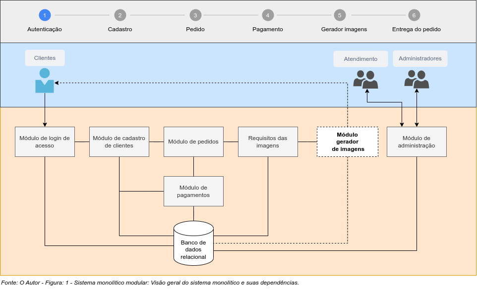
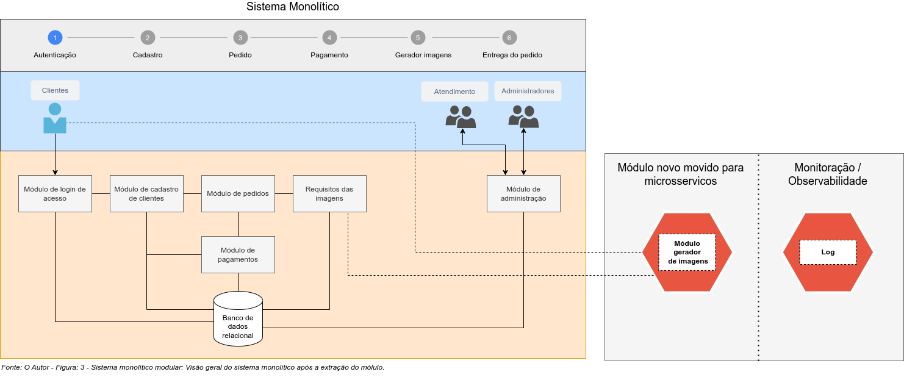

<!-- #region -->
# Criando Microsserviços: Projetando componete com Python, Flask e API OpenAI


**Introdução: O que são microsserviços?**

>***Newman (2022, p. 24) define microsserviços da seguinte forma:***
>
>(…) microsserviços são serviços que podem ser lançados de forma independente e são modelados com base em um domínio de negócios. Um serviço encapsula uma funcionalidade e a torna acessível a outros serviços através de redes – podemos criar um sistema mais complexo a partir destes blocos de construção. 
Um microsserviço pode representar um estoque, outro pode representar o gerenciamento de pedidos, enquanto outro ainda representa a expedição de mercadorias; juntos, porém, eles podem compor um sistema completo de comércio eletrônico.

**Contexto**

O desenvolvimento de microsserviços, tem sido uma área em rápido crescimento nos últimos anos, pois muitas empresas estão buscando construir sistemas de grande escala de maneira escalonável. Neste artigo, vamos descrever um exemplo de prova de conceito com microsserviço. O exemplo consiste, em desenvolver e implantar um microsserviço sem servidor. Microsserviços sem servidor, são um novo paradigma de desenvolvimento de aplicações baseadas na arquitetura de microsserviços. Ao contrário dos microsserviços tradicionais, os microsserviços sem servidor são executados em um ambiente de nuvem, que permite que as aplicações sejam executadas em qualquer lugar. Essa abordagem permite que as aplicações sejam acessíveis a partir de qualquer lugar, a qualquer hora, desde que exista uma conexão à internet.

**Objetivo**

O objetivo principal é verificar se microsserviços sem servidor são viáveis, e se atendem às necessidades de um projeto. Esta prova de conceito implementará uma solução de um problema hipotético de forma limitada.

**Definição do problema**

***Exemplo hipotético:***

Um sistema monolítico modular, que comercializa imagens e recebe centenas de requisições de pedidos na internet, está gerando muito "tikets" de suporte no setor de atendimento da empresa. A principal reclamação é lentidão na geração das imagens.

Um sistema monolítico modular, é um sistema de software cujas principais características são: código é mantido em módulos, todas as partes do sistema são dependentes e todos os módulos precisam ser atualizados ao mesmo tempo.
<!-- #endregion -->

**Implementação: Case**


Um estudo preliminar do problema, recomendou à gestão de produtos atualização urgente do sistema de imagens.


**Quais foram os principais desafios?**

- Tráfego do site muito alto;
- Código do sistema extenso e sem documentação;
- Complexidade para escalar e testar;
- Forte dependência dos componentes: o sistema inteiro pode ser afetado se o novo componente falhar.


**Solução**

> Não há uma solução única para este problema, estamos propondo um exercício para estudos.

A proposição foi refatorar o módulo de geração de imagens do sistema monolítico, transformando-o em um microsserviço.


**Implementação: Refatoração do sistema monolítico**

**Riscos**

a) O ambiente de produção suporta microsserviços?<br>
b) O custo da mudança será suportado pela empresa?<br>
c) Existe algum "gap" na equipe desenvolvimento para trabalhar com microsserviços?<br>
d) Temos visão clara do módulo que vamos extrair?<br>

**Design Parttners**

a) Refatore gradualmente;<br>
b) Estude padrões de migração e adote uma técnica; (exemplos: strangler fig, composição de UI, branch por abstração, execução em paralelo, colaborador decorado, captura de dados modificados e outros.)<p>


**Cenário atual: AS-IS**


Identifique o módulo a ser movido, as depedências, o fluxo do processo, quais serão as chamadas que serão redirecionadas e amplie a visão para descobrir a existência de dependências ou chamadas externas.
A figura 1. representa exemplo simplificado de verificação preliminar para ilustração de exemplo.





**Cenário futuro: TO-BE**


Figura 2. representa exemplo simplificado de extração do módulo gerador de imagens que foi identificado a ser movido para microsserviços. O ideal é mover a funcionalidade ou módulo para a nova arquitetura de microserviços sem fazer qualquer alteração no sistema atual, porém, nesse caso será preciso criar novo fluxo de requisições do módulo que gera os requisitos para criação das imagens e a entrega final ao cliente. Existem algumas técnicas, interceptação de mensagens ou roteamento não vamos abordar.





Arquitetura

Tecnologias: Python | Fask | OAuth | OpenAI API | Docker | AWS

Modelar

Comunicação

Monitoração

Segurança

Testes

Conclusão

```python

```

```python

```
